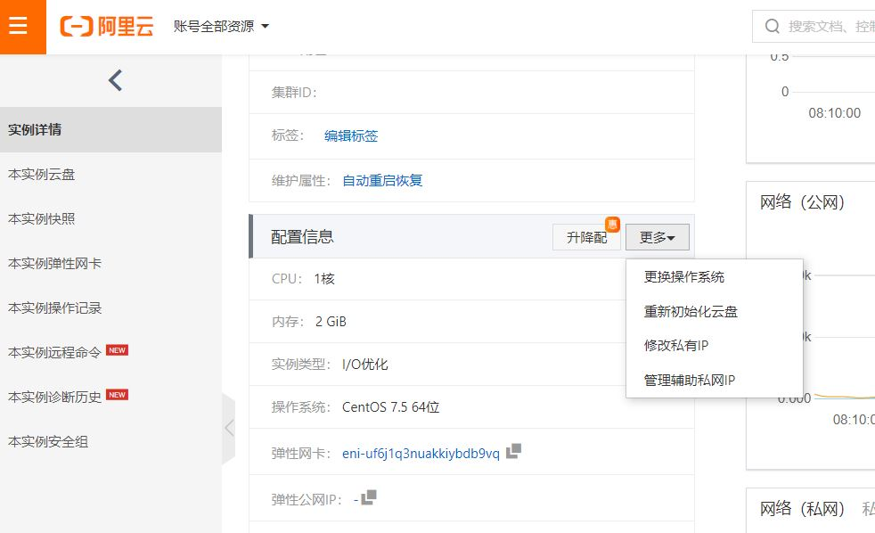
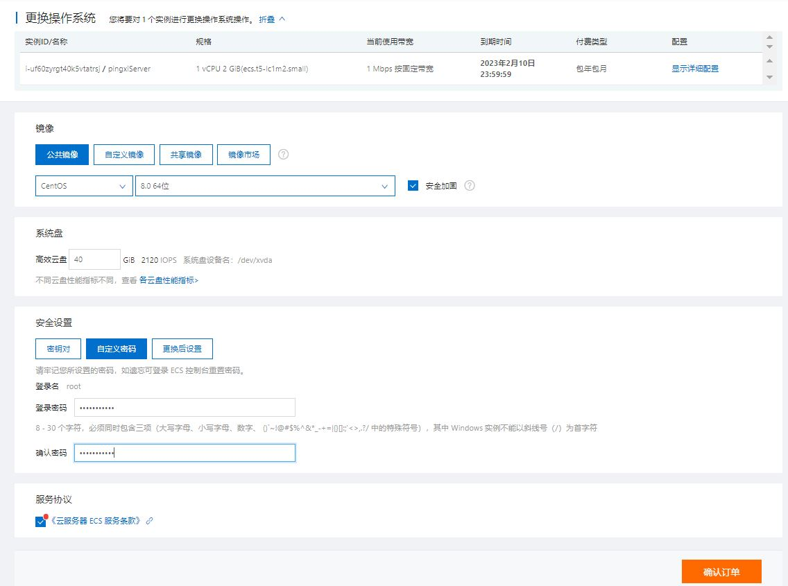
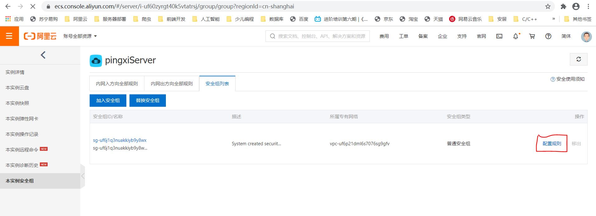
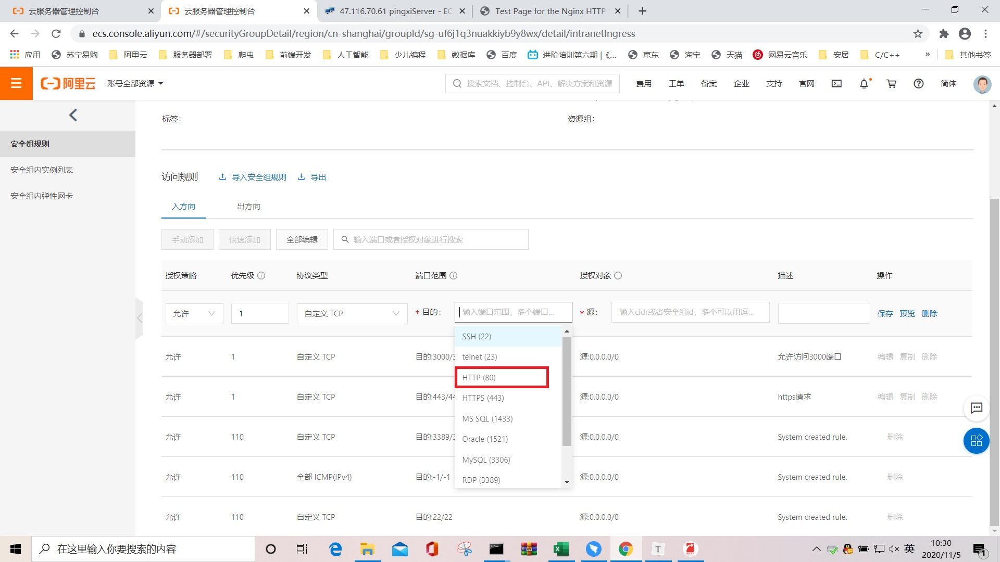
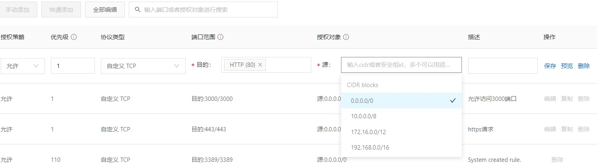
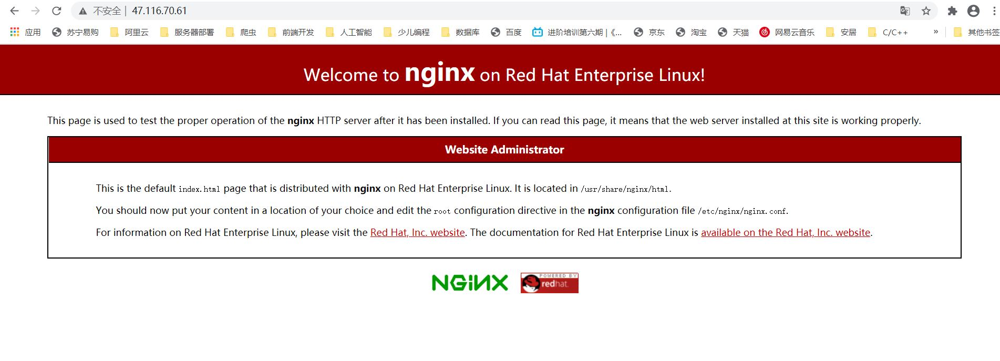
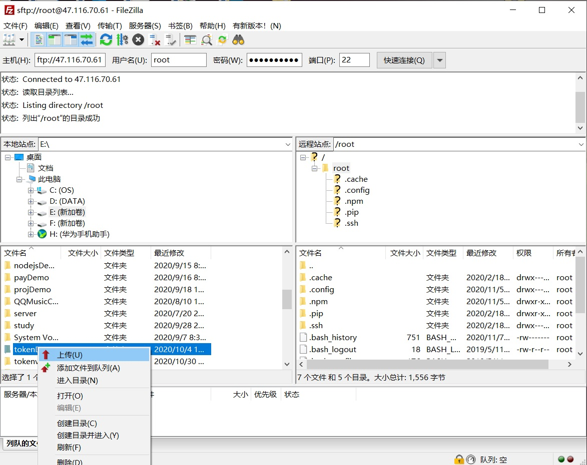
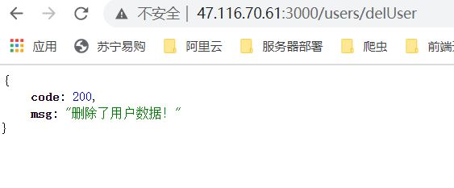

# 阿里云服务器部署项目解决方案
## 一、购买配置阿里云ECS服务器
  + 购买ECS服务器
    
  + 云服务器管理控制台
     点击下图中的实例名称，可以进入实例详情页面
    
  + 云服务器实例详情
    
  + 修改操作系统
    云服务器提供了多种操作系统，可以根据用户的需要进行快速更换，具体步骤如下：
    + 点击实例详情页面中的配置信息，可以更换服务器使用的操作系统
    
    + 更换操作系统时，选择公共镜像文件，并且需要设置用户密码，centOS的默认用户名是root，密码需要一定的复杂度，最后需要勾选服务协议
    

## 二、安装nginx服务器
  nginx是一款高性能的web服务器和反向代理服务器，可以部署静态网站并提供nodejs接口的访问
  + 安装nginx  
    sudo yum install -y nginx 
    
     
    
  + nginx服务相关命令
    - 开启服务器
      sudo systemctl start nginx
    - 关闭服务器
      sudo systemctl stop nginx
    - 查看服务器状态
      sudo systemctl status nginx
      - nginx正常运行时的状态
      
      - nginx不正常运行时的状态
      
    - nginx服务如果出现无法启动运行时，建议重启centOS
      
      
## 三、部署静态网站

   通过浏览器地址栏输入ECS云服务器的主机地址（可以通过服务器实例进行查询），此时浏览器无法打开页面，需要设置网络安全组规则，开启80端口访问才能正常访问
   

  + 配置阿里云的网络安全组规则，点击实例详情页面左侧列表中的本实例安全组，再点击右侧的配置规则
    
    - 在入方向选项中，点击手动添加安全规则
    
    - 填写目的和源两个文本框的参数
    
    - 配置安全规则的源
    
    
    安全组规则配置完成后，就可以正常访问主机服务器了
    
  + nginx默认网站路径
    /usr/share/nginx/html，后续vue生成的单页面应用项目可以保存到当前文件夹下
  + nginx服务器的配置文件
    /etc/nginx/nginx.conf，后续的端口、域名设置，反向代理等都在该文件中修改
  + Nginx域名的设置
    
  + 阿里云域名解析设置
     
     
  + 域名访问网站
    
    
## 四、安装Node服务器
   centOS默认安装的node版本偏低，需要通过以下设置进行高版本的安装
  + 删除旧版本（如果安装node后发现版本低，可以删除。初次安装系统时可以跳过本步骤）
    ```
    yum remove nodejs
    ```
    
  + 依次执行以下三行命令，安装稳定版本的配置（版本参考Node官网发布的信息，以下以node.js 12.19版本为例）
    ```
     yum clean all && yum makecache fast
     yum install -y gcc-c++ make  
     curl -sL https://rpm.nodesource.com/setup_12.x | sudo -E bash -
    ```
    
  + 安装node.js
    ```
    sudo yum install nodejs
    ```
    
    
  + 检查安装结果
    ```
    node -v
    npm -v
    ```
    
  + 安装express
    ```
    npm install -g express-generator
    npm install -g express
    ```
    
  + 上传node项目(可以采用fileZilla软件)
    - fileZilla链接远程服务器设置时主机协议使用sftp
    - 端口使用22
    - 本地站点选择在本地的项目文件夹，在选中项目文件夹上点击右键，在弹出的右键菜单中选择上传，可以将本地node项目上传到远程云服务器上
    - 远程站点选择在云服务器上的node项目安装路径
    
  + 配置安全组规则,允许访问3000端口（具体步骤参考前面80端口的设置） 
    
  + 在本地浏览器中输入远程IP地址+3000端口，可以调用接口，并获取接口返回的数据
    
    
## 五、部署vue项目
+ 修改vue.config.js配置文件
  ```
      publicPath:'./'
  ```
+ 修改项目路由
  ```
  const router = new VueRouter({
      base:'/dist',
      mode: 'history',
      routes
    })
  ```
+ 生成项目
  ```
    npm run build
  ```
+ 将dist文件夹上传到云服务器的指定位置
   将上一步骤中生成的dist文件夹上传到nginx文件夹下，路径/usr/share/nginx/html
+ 修改nginx.conf配置文件
  ```
        location  / {
            root html;
            index index.html index.htm;
        }
		
  ```
 ```
        # 通过反向代理，访问接口
        location ^~ /api/ {
            rewrite ^/api/(.*)$ /$1 break;
            proxy_pass http://127.0.0.1:3000/;
        }
 ```
 ```
    #解决二级页面刷新显示404错误问题
    error_page   404 500 502 503 504  /index.html;
        location = /index.html {
            root   html/dist; 
            #html/dist表示的是nginx目录下html文件夹下的dist项目，dest是vue项目打包后生成的文件夹
           
}
 ```
+ 通过地址栏输入http:服务器端地址/dist，可以访问网站的首页    

## 六、部署数据库mysql
+ 配置MySQL安装源
  ```
  sudo rpm -Uvh https://dev.mysql.com/get/mysql80-community-release-el7-1.noarch.rpm
  ```
+ 安装mysql
  ```
  sudo yum --enablerepo=mysql80-community install mysql-community-server
  ```
+ 启动、查看服务
  ```
  sudo service mysqld start
  service mysqld status
  ```
+ 查看临时密码
  ```
  grep "A temporary password" /var/log/mysqld.log
  ```
+ 修改密码
  ```
  mysql -uroot -p 用临时密码登录mysql
  ALTER USER 'root'@'localhost' IDENTIFIED BY '新密码';
  
  ```
+ 将将项目使用的sql脚本文件拷贝到centOS中，然后运行（没有创建数据库的需要先创建）
```
  mysql –u用户名 –p密码 –D数据库<【sql脚本文件路径全名】
```


